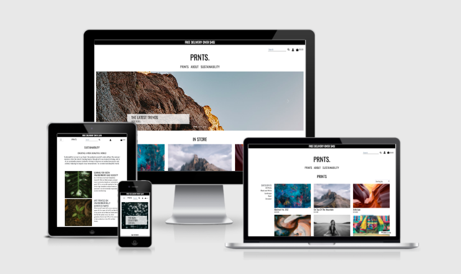
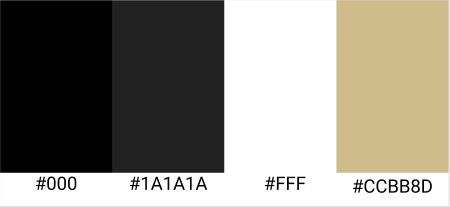

<h1 align="center">PRNTS.</h1>

<span id="breaktasty"></span>



At PRNTS., we have the latest in art and design, with many different styles of wall art! An atmosphere wall art can add atmosphere to a home.  Art should be for everyone! 

PRNTS. offers different pieces of wall art in different designs. We offer inspiration in interiors and design, whether the art is for the bedroom, a small hallway, an office or an entire home. PRNTS. add more affordable wall art to help you create a complete look. 

This project is the fourth out of four Milestone Projects in the Full Stack Web Development Program I am attending at The Code Institute. 

**[View the live project here.](https://ms4-prnts.herokuapp.com/)**

---

## Index 

- <a href="#ux">1. User experience (UX)</a>
    - <a href="#ux-goals">1.1. Project Goals</a>
    - <a href="#business-goals">1.2 Business Goals</a>
    - <a href="#visitor-goals">1.3 Visitor Goals</a>
    - <a href="#target-audience">1.4 Target Audience</a>
    - <a href="#ux-stories">1.5 User Stories</a>
    - <a href="#ux-design">1.6 Design</a>
    - <a href="#ux-mockup">1.7 Mockup designs</a>
- <a href="#information-architecture">2. Information Architecture</a>
    - <a href="#database">2.1 Database</a>   
    - <a href="#data-modelling">2.2 Data Modelling</a>
- <a href="#features">3. Features</a>
    - <a href="#features-existing">3.1 Existing features</a>
    - <a href="#features-future">3.2 Features left to implement in the future</a>
- <a href="#technologies">4. Technologies used</a>
- <a href="#testing">5. Testing</a>
- <a href="#deployment">6. Deployment</a>
- <a href="#credits">7. Credits</a>
- <a href="#Acknowledge">8. Acknowledge</a>
- <a href="#Acknowledge">9. Disclaimer</a>

---

<span id="ux"></span>

<h1>1. User experience (UX)</h1>

<span id="ux-goals"></span>

### 1.1 Project goals 

- Making a full-stack site based around business logic used to control a centrally-owned database. 
- The site provides an authentication mechanism and provides paid access to the site’s data based on the dataset. 
- Making a full-stack site that uses HTML, CSS, JavaScript, Python + Django.
- Creating a website that uses a relational database 
- Creating a website that uses Stripe payments 
- Creating a website that serves as a webshop to sell prints with different types of art. 

<span id="business-goals"></span>

### 1.2 Business goals

- Creating a secure and professional e-commerce website. 
- Provide users inspiration for different art and designs. 
- Makes profit with selling prints. 
- Makes art accessible to everyone.

<span id="visitor-goals"></span>

### 1.3 Visitor goals

- Get inspired for wall art in the office or at home. 
- Safely purchase prints on the webshop. 

<span id="target-audience"></span>

### 1.4 Target audience

- Everyone who loves art.
- People who want to be inspired for wall art. 
- People who are looking for wall art to decorate their home, office, etc. 

<span id="ux-stories"></span>

### 1.5 User stories 

**Visitor goals:**
1. As a visitor, I want to access the website from any device, so that I can go to the website on desktop, mobile and tablet. 
2. As a visitor, I want to be able to navigate easily through the website, so I can find everything easily. 
3. As a visitor, I want to access the social media accounts of the company, so I can follow them and see the latest trends and news. 
4. As a visitor, I want to sign up for the newsletter, so I can be up to date about the latest news and trends. 
5. As a visitor, I want to know more about the company, so I know what the company is about.
6. As a visitor, I want to be able to contact the owners of the website, so I can easily ask a question. 
7. As a visitor, I want to see an overview of all the wall art, so I can see what the website is offering. 
8. As a visitor, I want to be able to search and filter the wall art, so I can find specific wall art quick and easy.
9. As a visitor, I want to be able to read more information about the wall art (size, price, image, description), so I can see if the product suits my preferences. 


**Consumer goals:** 

10. As a consumer, I want to add products to my basket, so I can buy products. 
11. As a consumer, I want to modify my order, so I can make last changes before I order the products. 
12. As a consumer, I want to be able to delete products in my order, so I can remove products that I no longer wish to purchase. 
13. As a consumer, I want to see the total price and shipping costs of my order, so I can see how much I have spent in total. 
14. As a consumer, I want to pay with a card in a safe and secure way, so I know that my payment goes well. 
15. As a consumer, I want to receive a confirmation email of the order, so I know that the order is successfully received. 
16. As a consumer, I want to create an account, so I can see my profile details and order history. 
17. As a consumer, I want to know more about shipping, delivery, etc., so I know more about when and how my package arrives. 
18. As a consumer, I want to know how I can return my package, so I know how I can return my packages if I want to. 

**Returning consumer goals:** 

19. As a returning consumer, I want to login and logout at my account anytime, so I can make an order quickly and so I can see my order history. 
20. As a returning consumer, I want to reset/change my password (if I forgot it), so I can get access to my profile. 
21. As a returning consumer, I want to be able to change my email, so I can have access to the profile with another email address. 

**Admin goals:** 

23. As admin, I want to add, modify and delete products, so I manage the assortment of all products on the website. 

<span id="ux-design"></span>

### 1.6 Design 

- #### Frameworks

[The Bootstrap front-end framework](https://getbootstrap.com/) is used through the project. Bootstrap provides a quick design, responsive grid system, extensive prebuilt components and a modern interface for the project.  

- #### Colour scheme 
The four colours that are used for the website are very simple and calm colours. These colours are used because the colours give a sleek and modern look. 
The products stand out of the calm and sleep appearance of the colours.



- #### Fonts
The **Oswald** form is used throughout the whole website. The sans serif font serves as fallback in case the main font isn’t being imported to the site correctly. The Oswald font us used for all text on the website. This font is used because the font is sleek and clear and is easy to read. The font is used in uppercase letters for all titles and lowercase letters are mainly used for paragraphs. 

- #### Icons
The icons in the project are provided by [Font Awesome](https://fontawesome.com/). All icons that are used have functional purposes such as the hamburger menu for the mobile version and social media icons.

- #### Images
The images that are used for the project are from [Pexels](https://www.pexels.com/). The images are used for product images, the lookbook, atmosphere photo’s and header images. 

<span id="ux-mockup"></span>

### 1.5 Mockup designs
Mockup designs are made with [Figma.](https://www.figma.com/)

Click on the links below to see the mockups in Figma.
|    Mobile   |    Tablet / Desktop   | 
|    :----:    |     :----:   |   
|[PRNTS.](https://www.figma.com/file/5lzlSoiNpQmvPJJZQRbSC8/MS4-PRNTS.?node-id=33%3A0)|[PRNTS.](https://www.figma.com/file/5lzlSoiNpQmvPJJZQRbSC8/MS4-PRNTS.?node-id=0%3A1) | 

<div align="right">
    <a href="#breaktasty">↥ Back to top!</a>
</div>

<span id="information-architecture"></span>

<h1>2. Information Architecture</h1>

<span id="database"></span>

### 2.1 Database
- During the development phase I have worked with the **sqlite3** database, which was set by default by Django. 
- For deployment, I used the **PostgreSQL** database whcih is provided by Heroku. 

<span id="data-modelling"></span>

### 2.2 Data Modelling

#### 1. Profile app 
#### UserProfile model

| **Name** | **Database Key** | **Field Type** | **Validation** |
--- | --- | --- | --- 
 User | user | OneToOneField |  User, on_delete=models.CASCADE
 Full Name | default_full_name | CharField | max_length=50, null=True, blank=True
 Phone number | default_phone_number | CharField | max_length=20, null=True, blank=True
 Country | profile_country | CountryField | blank_label='Country', null=True, blank=True
 Postcode | profile_postcode | CharField | max_length=20, null=True, blank=True
 Town/City | default_town_or_city | Charfield | max_length=40, null=True, blank=True
 Address address 1 | default_street_address1 | CharField | max_length=80, null=True, blank=True
 Address address 2 | default_street_address2 | CharField | max_length=80, null=True, blank=True

#### 2. Products app 
#### Category model

| **Name** | **Database Key** | **Field Type** | **Validation** |
--- | --- | --- | --- 
 name | name | CharField | max_length=254
 Friendly name | friendly_name | CharField | max_length=254, null=True, blank=True

 #### Product model

| **Name** | **Database Key** | **Field Type** | **Validation** |
--- | --- | --- | --- 
 Category| category| ForeignKey | Category, null=True, blank=True, on_delete=models.SET_NULL
 Sku number | sku | CharField | max_length=40, null=True, blank=True
 Name| name | CharField | max_length=250
 Description| description | TextField | null=True, blank=True
 Price | price | DecimalField | max_digits=5, decimal_places=2, null=False, default=0
 Image | image | ImageField | null=True, blank=True
 Image url | image_url | URLField | max_length=1024, null=True, blank=True
 In stock | in_stock | BooleanField | default=True

#### 3. Checkout app 
#### Order model

| **Name** | **Database Key** | **Field Type** | **Validation** |
--- | --- | --- | --- 
 Order number | order_number | CharField | max_length=32, null=False, editable=False
 User profile | user_profile | ForeignKey | UserProfile, on_delete=models.SET_NULL, null=True, blank=True, related_name='orders'
 Full name | full_name | CharField | max_length=50, null=False, blank=False
 Email| email| EmailField | max_length=254, null=False, blank=False
 Phone number | phone_number | Charfield | max_length=20, null=True, blank=True
 Country| country | CountryField | blank_label='Country *', null=False, blank=False
 Postcode | postcode| CharField | max_length=20, null=True, blank=True
 Town/City | town_or_city | CharField | max_length=40, null=True, blank=True
 Address address 1 | street_address1 | CharField | max_length=80, null=True, blank=True
 Address address 2 | street_address2 | CharField | max_length=80, null=True, blank=True
 Date | date | DateTimeField | auto_now_add=True
 Delivery cost | delivery_cost | DecimalField | max_digits=6, decimal_places=2, null=False, default=0
 Order total | order_total | DecimalField | max_digits=10, decimal_places=2, null=False, default=0
 Grand total | frand_total | DecimalField | max_digits=10, decimal_places=2, null=False, default=0
 Original bag | original_bag | TextField | null=False, blank=False, default=''
 Stipe pid | stripe_pid | CharField | max_length=254, null=False, blank=False, default=''

 #### OrderLineItem model

| **Name** | **Database Key** | **Field Type** | **Validation** |
--- | --- | --- | --- 
 Order  | order | ForeignKey | Order, null=False, blank=False, on_delete=models.CASCADE, related_name='lineitems'
 Product | product | ForeignKey | Product, null=False, blank=False, on_delete=models.CASCADE
 Quantity | quantity | IntegerField | null=False, blank=False
 Lineitem total | lineitem_total | DecimalField | max_digits=6, decimal_places=2, null=False, blank=False, editable=False

#### 4. Contact app 
#### ContactMessage model

| **Name** | **Database Key** | **Field Type** | **Validation** |
--- | --- | --- | --- 
 Full name | full_name | CharField | max_length=50
 Email| email| EmailField | 
 Message | message| TextField | 

#### 5. Newsletter app 
#### Subscribe model

| **Name** | **Database Key** | **Field Type** | **Validation** |
--- | --- | --- | --- 
 Email | email| EmailField | max_length=255
 Timestamp | timestamp | DateTimeField | auto_now_add=True

<div align="right">
    <a href="#breaktasty">↥ Back to top!</a>
</div>

<span id="features"></span>

<h1>3. Features</h1>

<span id="features-existing"></span>

### 3.1 Existing features 

The website is classified by 8 applications: home, about, products, checkout, profiles, pages, newsletter and contact.

#### 1. Navbar
- **The name** (which also serves as logo) is clearly visible in the middle of the navbar. The name is also a redirect to the home page. 
- The navbar contains the **search functionality**, where the user can search for products. The search term would match with the product name or  the product description. 
    - The search functionality allows users to enter keywords associated with the name or the description of the product. 
    - The search results are displayed on the products page. 
    - On the product page, a message will appear with ‘no results’ if there are no search results.
- The navbar contains the **profile icon**, where people can login, register and go to their profile.
- The navbar contains the **shopping bag**, where users can see the items they have put in order. The basket redirects to the order summary. 
- The navbar is visible as a **hamburger menu** on mobile devices. 

#### 2. footer
- **Relevant links** such as the categories of the products, the account, FAQ, return policy and contact are placed at the bottom of the footer.
- The **social media links** are placed at the bottom of the footer. 


#### 3. Home page 
- The home page serves as an introduction to the webshop with relevant information and inspiration.
- The **header images** are on top of the page. There are three images that rotate all time. Each image has a piece of content with a CTA to different sections on the website. For example, the products.
- There is a section with **products** that are in store. 
- There is a section with **information about** the wall art of PRNTS. and art and design in general.
- There is a separate section with four **unique selling points**  (fast delivery, free shipping, sustainability and free delivery.) displays with icons. 
- There is a separate section where people can **sign up for the newsletter**. The newsletter is linked to Mailchimp to automatically send emails to the mailing list 


#### 4. Product page 
- The product page contains all items the shop has to offer
- All **categories** are displayed on the right site of the page, so that users can easily navigate through the categories.
- The items can be **sorted** by name A-Z, Z-A, price from high to low and price from low to high
- There is a **back to top button**, where people can click on the link to go back to the top of the page. 
- There is a separate section with four **unique selling points**  (fast delivery, free shipping, sustainability and free delivery.) displays with icons. 
- There is a separate section where people can **sign up for the newsletter**.  

#### 5. Product detail page 
- **The product detail page shows information about that specific item**, the information includes; name, image, if the item is in stock, delivery information, the price and the product description. 
- **People only can buy the product if the product is in stock.** If the product isn’t in stock, the content on the product detail page will say that the product is sold out and the page is referring to the contact page. 
- A user can **choose the quantity** of the product. The product quantity can be between 1 and 99 items. 
- A user can **see the size** of the product. For all products applies one size only.
- There is a button where the user can **add the item to the shopping bag**.
    - When the user  puts the item in the bag there will be a toast success message.
    - When the user puts the item in the bag, the shopping bag in the navbar will show the number of items that are in the shopping bag.
- There is a **‘back to all prints’** link that redirects to the product page. 
- There is a separate section with four **unique selling points** (fast delivery, free shipping, sustainability and free delivery.) displays with icons. 
- There is a **cta section to all products**.

#### 6. The shopping page
- **The shopping bag page is available for logged in users and guests.** Purchases can be made by both of them. shopping bag page 
- Gives **an overview of all items** that are in the shopping bag, the overview information includes; image, name, size, quantity, price and subtotal.
- users  can **update the quantity** of the items they have.
- users  can **delete items** from their order.
- There is an **overview of the total price, the delivery costs and the grant total** of the order.
- There is a button with **‘keep shopping’** that links to the product page. 
- There is a button with **‘go to checkout’** to continue the purchase.

#### 7. Checkout page 
- The **order summary** gives information about the item, this information includes; name, size, price, total, delivery costs and grant total. 
- There is an option to **login with an account**, where the personal and delivery information already exists to continue the payment process quickly. 
- **The checkout form** to continue the payment. The form asks for the following information: full name, email, phone number, country, postal code, town or city and  street address 1 - all these input fields must be valid. The country field is an input where users can scroll to a list to choose the country.
- At the end of the checkout form there is an option to **save** the delivery information to an account. This function only shows when the user is authenticated.
- The user has to fill in their information about the card number. The Stripe functionality is in testing mode, the credit card number **4242 4242 4242 4242** will lead to a successful payment. expiration date, CVC and ZIP can be made up yourself.
- A **webhook** is used for security when the order is processed, even in the case when the payment process is interrupted.
- There is a **button to go back to the shopping bag page.** The user can go back to the shopping bag page to adjust items in the bag.
- There is a button to **complete the order**.
- When the user clicks on the complete the order button, there is a little **loading overlay**. The user is directed to the checkout success page after the overlay. 
- **When the order is completed:**
    - There is a redirect to the checkout success page.
    - A confirmation email is sent to the user’s mail.
    - A toast message ‘completed’ shows to ensure the user that the order is successfully completed.

#### 8. Checkout succes page
- Contains a **thank you message**.
- Includes information about the **order summary**. The order summary consists of information about the date, order number, products, delivery information and billing information. 
- There is a button to go back to the product page.

#### 9. The company page 
- Is split in three sections 
    - The first section contains information about **the company itself and its vision**. 
    - The second section contains information about **the products**.
    - The third section contains information about **sustainability**.

#### 10. The profile page 
- The account page is only accessible for users who have an account. 
- The page contains a **personal info section** (username, email). The user can change the password and edit their email. 
- There is a shipping **info section** (country, postal code, town/city, street address 1 and street address 2. Users can **edit this information** also. 
- There is an **order history** section (order number, date of order, items and total) 

#### 11. FAQ page 
- This page contains all relevant questions users divided in two main sections; delivery, returns. 

#### 12. Return policy page 
- Contains all information about the return policy of PRNTS.

#### 13. Contact page 
- Users can reach out to the company with the **contact form**. The user has to fill in the name, email and message. The form will be sent to the admin. 
- **Contact details** (phone number, email) are displayed on this page. 
- There is a separate section with four **unique selling points** (fast delivery, free shipping, sustainability and free delivery.) displays with icons. 
- There is a **cta section to all products**.

#### 14. Django-Allauth features 
- **Sign up**
    - Users can create a new account by filling in a from where the user have to fillin a email, username, password and password confirmation. If the info already exists there will be a message that he/she already has an account. The user can submit the form when the data is new. A verification email is sent to the user.
- **Login**
    - Users can login with their username ans password. There is also a link to change the password, if the user is forgotten it. 
- **Forgot password**
    - A user can reset their password. 
- **Logout** 
    - The user can logout by clicking the logout link. After clicking the link there wil a confirmation if the user is sure to logout. 

#### 15. Error pages 
- There are custom error handling pages with short information about the error. The errors are displayed in the style of the website. 
- The following errors are included: 400, 403, 404 and 500.

<span id="features-future"></span>

### 3.2 Features left to implement in the future 
- Adding a favorite section. Users can favorite their product and see them on their favorite page if they are logged in. 
- Logging in with social media account, such as Facebook and Google.
- Greating a loyalty programme, where users can save points for discounts.
- Expand the range where people can choose between different sizes. In addition, they calso can buy frames for the products.

<div align="right">
    <a href="#breaktasty">↥ Back to top!</a>
</div>

<span id="technologies"></span>

<h1>4. Technologies used</h1>

#### Languages used
- [HTML5](https://en.wikipedia.org/wiki/HTML5)
    - HTML5 provides the structure and the content for my project. 
- [CSS3](https://en.wikipedia.org/wiki/Cascading_Style_Sheets)
    - CSS3 provides the style of the HTML5 elements.
- [JavaScript](https://nl.wikipedia.org/wiki/JavaScript)
    - JavaScript provides the interactive elements on the website. 
- [jQuery](https://jquery.com/)
    - jQuery is used for implementation of Bootstrap.
- [Python](https://www.python.org/)
    - Python provides the backend of the project.
- [Jinja](https://en.wikipedia.org/wiki/Jinja_(template_engine))
    - Jinja provides the templating language for Python.

#### Frameworks, libraries & other
- [Django](https://www.djangoproject.com/) 
    - The GitPod is used as Python framework for the project.
- [Gitpod](https://www.gitpod.io/) 
    - The GitPod is used to develop the project.
- [Git](https://git-scm.com/)
    - The Git was used for version control to commit to Git and push to GitHub.
- [GitHub](https://github.com/)
    - The GitHub is used to host the project.
- [Pip3](https://pip.pypa.io/en/stable/)
    - Pip3 is used for installing the necessary tools, libraries and frameworks.
- [Heroku](https://heroku.com/)
    - Heroku is used to host the project.
- [AWS Amazon](https://aws.amazon.com/)
    - AWS Amazon is used to store static and media files.
- [Boto3](https://boto3.amazonaws.com/v1/documentation/api/latest/index.html)
    - Boto3 is used for compatibility in AWS.
- [Gunicorn](https://pypi.org/project/gunicorn/)
    - Gunicorn is used to enable deployment to Heroku.
- [Spycopg2](https://pypi.org/project/gunicorn/)
    - Spycopg2 is used to enable the PostGreSQL database to connect with Django.
- [Google Fonts](https://fonts.google.com/)
    - Google Fonts is used to provide the font roboto for all the text that is used in the project. 
- [Figma](https://www.figma.com/)
    - Figma is used to create the mockup designs for the project.
- [Bootstrap](https://getbootstrap.com/)
    - Bootstrap is used for the design framework.
- [Heroku](https://dashboard.heroku.com/)
    - Heroki is the cloud platform to deploying the app.
- [Django Crispy Forms ](https://django-crispy-forms.readthedocs.io/en/latest/)
    - Django Crispy Forms is used to style the Django forms
- [Stripe](https://stripe.com/en-nl)
    - Stripe is used for the secure payments 
- [Mailchimp](https://mailchimp.com/)
    - Mailchimp is used to send newsletters to the mailinglist

#### Databases 
- [SQlite3](https://www.sqlite.org/index.html)
    - SQlite3 is used as the development database.
- [PostgreSQL](https://www.postgresql.org/)
    - PostgreSQL is used as the production database.

#### Testing tools used 
- [Chrome DevTools](https://developers.google.com/web/tools/chrome-devtools/open) is used to detect problems and test responsiveness.
- [Autoprefixer](https://autoprefixer.github.io/)
    - Autoprefixer is used to parse the CSS and to add vendor prefixes to CSS rules. 
- [W3C Markup Validation Service](https://validator.w3.org/)
    - The W3C Markup Validation Service is used to check whether there were any errors in the HTML5 code. 
- [W3C CSS validator](https://jigsaw.w3.org/css-validator/)
    - The W3C CSS validator is used to check whether there were any errors in the CSS3 code.
- [JShint](https://jshint.com/)
    - JShint is a JavaScript validator that is used to check whether there were any errors in the JavaScript code. 
- [PEP8](http://pep8online.com/)
    - The PEP8 validator is used to check whether there were any errors in the Python code.

<div align="right">
    <a href="#breaktasty">↥ Back to top!</a>
</div>

<span id="testing"></span>

<h1>5. Testing</h1>

The testing process can be found [here](TESTING.md).

<div align="right">
    <a href="#breaktasty">↥ Back to top!</a>
</div>

<span id="deployment"></span>

<h1>6. Deployment</h1>

#### Requirements 
- Python3 
- Github account 
- Heroku account
- An IDE of choice 
- Stripe account
- AWS Amazon account
- Gmail account

#### Clone the project 
To make a local clone, follow the following steps. 
1. Log in to GitHub and go to the repository. 
2. Click on the green button with the text **“Code”.**
3. Click on **“Open with GitHub Desktop”** and follow the prompts in the GitHub Desktop Application or follow the instructions from **[this link](https://docs.github.com/en/free-pro-team@latest/github/creating-cloning-and-archiving-repositories/cloning-a-repository#cloning-a-repository-to-github-desktop)** to see how to clone the repository in other ways. 

#### Working with the local copy
1. Install all the requirements: Go to the workspace of your local copy. In the terminal window of your IDE type: **pip3 install -r requirements.txt**.
2. Set up the environment variables: 
    - Create a `.gitignore` file in the root directory of the project. 
    - Create a `.env` file. This will contain the following environment variables:

    ```
    Import os
    os.environ("SECRET_KEY", "Added by developer")
    os.environ("STRIPE_PUBLIC_KEY", "Added by developer")
    os.environ("STRIPE_SECRET_KEY", "Added by developer")
    os.environ("STRIPE_WH_SECRET", "Added by developer")
    os.environ("MAILCHIMP_API_KEY", "Added by developer")
    os.environ("MAILCHIMP_DATA_CENTER", "Added by developer")
    os.environ("MAILCHIMP_EMAIL_LIST_ID", "Added by developer")
    ```
    - Add the `.env` file to the `.gitignore` file.
    **NOTE:** See more in the [Stripe Documentation](https://stripe.com/docs/keys) to read more about setting the API key.
3. Migrate the models to create the database by the following commands:
    - `python3 manage.py makemigrations`
    - `python3 manage.py migrate`
4. Load the data fixtures for categories and product in this exact order:
    - `python3 manage.py loaddata categories`
    - `python3 manage.py loaddata products`
5. Create a superuser. The superuser has acces to the admin environment.
    - `python3 manage.py createsuperuser`
    - Enter your username, email and password.
6. Run the app: Open your terminal window in your IDE. Type: `python3 manage.py runserver` and run the app.
7. To acces the admin environment, you can add `/admin` at the end of your url and login with the superuser.


#### Heroku Deployment  
1. Set up local workspace for Heroku 
    - In terminal window of your IDE type: `pip3 freeze -- local > requirements.txt.` (The file is needed for Heroku to know which filed to install.)
    - Create a Procfile with the following text: `web: gunicorn <name app>.wsgi:application` (The file is needed for Heroku to know which file is needed as entry point.)
    - Push all these files to your GitHub reposity.
2. Set up Heroku
    - Create a Heroku account and create a new app and select your region. 
    - Go to resources in Heroku and search for **postgess**. Select **Hobby dev - Free** and click on the provision button to add it to the project.
    - Go to the settings app in Heroku and go to **Config Vars**. Click on **Reveal Config Vars** and add the following config variables:

    | KEY            | VALUE         |
    |----------------|---------------|
    | AWS_ACCESS_KEY_ID | `<aws access key>`  |
    | AWS_SECRET_ACCESS_KEY | `<aws secret access key>`  |
    | DATABASE_URL| `<postgres database url>`  |
    | EMAIL_HOST_PASS | `<email password(generated by Gmail)>` |
    | EMAIL_HOST_USER| `<email address>`  |
    | MAILCHIMP_API_KEY| `<api key>`  |
    | MAILCHIMP_DATA_CENTER| `<datacenter id>`  |
    | MAILCHIMP_EMAIL_LIST_ID| `<emailist id>`  |
    | SECRET_KEY | `<your secret key>`  |
    | STRIPE_PUBLIC_KEY| `<your stripe public key>`  |
    | STRIPE_SECRET_KEY| `<your stripe secret key>`  |
    | STRIPE_WH_SECRET| `<your stripe wh key>`  |
    | USE_AWS | `True`  |

3. Set up Database
    - Copy the **DATABASE_URL** (Postgres URL) from the config variables of Heroku and past it into the default database in `setting.py`

    ```
    DATABASES = {
        'default': dj_database_url.parse("<DATABASE_URL here>")
    }
    ```
    **NOTE:** This setup for the databases is temporary for deployment to Heroku.
    - Migrate the models to create the database by the following commands:
        - `python3 manage.py makemigrations`
        - `python3 manage.py migrate`
    - Load the data fixtures for categories and product in this exact order:
        - `python3 manage.py loaddata categories`
        - `python3 manage.py loaddata products`
    - Create a superuser. The superuser has acces to the admin environment.
        - `python3 manage.py createsuperuser`
        - Enter your username, email and password.
    - Now you can remove the DATABASE_URL from `settings.py` and set the 'old' default DATABSE settings.
    - Adjust the ALLOWED_HOSTS in you settings.py with the following:
    
    ```
    ALLOWED_HOSTS = ['<your Heroku app URL>', 'localhost]
    ```
    - Push the code to Github.
4. Connect with Heroku 
    - Click on the **Connect to GitHub** section in the deploy tab in Heroku. 
        - Search your repository to connect with it.
        - When your repository appears click on **connect** to connect your repository with the Heroku. 
    - Set automatic deploment: Go to the deploy tab in Heroku and scroll down to **Aotmatic deployments**. Click on **Enable Automatic Deploys**. By **Manual deploy** click on **Deploy Branch**.
Heroku will receive the code from Github and host the app using the required packages. 
Click on **Open app** in the right corner of your Heroku account. The app wil open and the live link is available from the address bar. 

#### Hosting static and media files with AWS
The static and media files are hosted in the AWS S3 Bucket. To host them you will need an account and create an S3 bucket and set a group, policy and user in the IAM environment. 
Read more about the the S3 Bucket storage [here](https://aws.amazon.com/s3/). For more information about the storage in your project [click here](https://django-storages.readthedocs.io/en/latest/backends/amazon-S3.html).

<div align="right">
    <a href="#breaktasty">↥ Back to top!</a>
</div>

<span id="credits"></span>

<h1>7. Credits</h1>

#### Content
- The content of the product and sustainability section on the about page is coming from [Desenio](https://desenio.co.uk/). 
- The content of the sustainability page is partly coming from [Desenio](https://desenio.co.uk/). 
- The content of the FAQ page is coming from Na-kd [Na-kd](https://www.na-kd.com/en) and [Things I like Things I love](https://www.thingsilikethingsilove.com/).
- The content of the return policy is coming from Na-kd [Na-kd](https://www.na-kd.com/en)

#### Media 
- All images are from [Pexels](https://www.pexels.com).

#### Code
- The code for the project is partly from the video lessions of the Boutique Ado project of [Code Institute](https://codeinstitute.net/). 
- [Stack Overflow](https://stackoverflow.com/) was helpful for little bugs or troubles in the code. 
- [Mailchimp connection video](https://www.youtube.com/watch?v=2KeV42YaPes) helped me to place the MailChimp API in my project.

<div align="right">
    <a href="#breaktasty">↥ Back to top!</a>
</div>

<span id="Acknowledge"></span>

<h1>8. Acknowledge</h1>

Thanks to the following people and organizations who helped or inspired me for the project:  
- The support and guidance of my mentor Precious Ijege. 
- The lessons and knowledge of [Code Institute.](https://codeinstitute.net/)
- The advice about bugs from the Tutor Assistance of Code Institute.

<div align="right">
    <a href="#breaktasty">↥ Back to top!</a>
</div> 
<span id="Disclaimer"></span>

<h1>9. Disclaimer</h1>
This project is for educational purposes only. If there is an issue with the copyright or the content, please contact me: juan.stelling@gmail.com

Thanks for visiting

<div align="right">
    <a href="#breaktasty">↥ Back to top!</a>
</div>